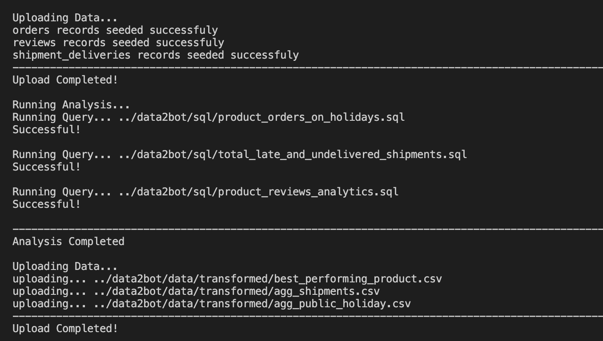
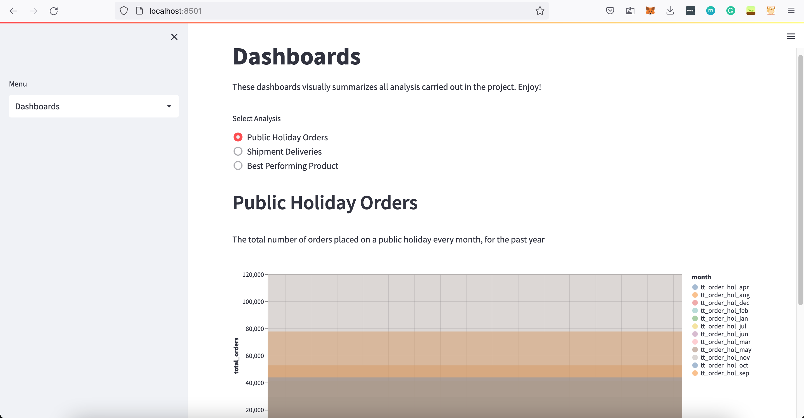
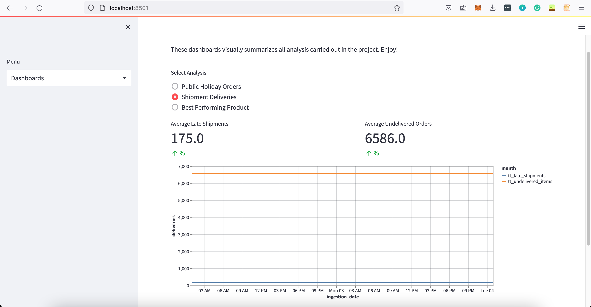

# **D2b Data Pipeline**
## **Overview**
D2b is a simple data pipeline designed to help automate the processes involved in extracting, transforming, analysing and exporting data insights carried out by data professionals at D2B (Imaginary Company). The automation pipeline is designed to abstract complexities and allow analysts to focus solely on SQL.


## **Key Implementation Tools**
✅ &nbsp; &nbsp;  <a href='https://python.org'> Python </a> <br>
✅ &nbsp; &nbsp;  <a href='https://www.postgresql.org'> Postgresql </a> <br>
✅ &nbsp; &nbsp;  <a href='https://squidfunk.github.io/mkdocs-material/getting-started/'> Makedoc </a><br>
✅ &nbsp; &nbsp;  <a href='https://www.gnu.org/software/make/manual/make.html'> GNU Makefile </a><br>
✅ &nbsp; &nbsp;  <a href='https://www.github.com'> Github Actions </a>

## **Installation and setup** 🔩🪛
Clone the repository.
```bash 
git clone https://github.com/anochima/d2b.git
cd d2b
```

```bash
make setup
```
The above commands: 

* Creates and activate a virtual environmnent (.d2b) at the root directory
* Installs all neccessary packages needed to successfully run the project
* And finally creates a configuration file (config.ini) for setting up the Database connections, etc.

## **Database Configuration** 👨🏽‍💻
After running the above script, a new configuration file will be added to the project directory `config.ini`. Make sure to set up all necessary configurations for the database. 


Note ℹ️: The `config.ini` file is intended to abstract valuable information regarding database connection. 
Hence, informations added here will be ignored during deployment.


```MD
[SERVER]
DB_CONNECTION=pgsql
DB_HOST=localhost
DB_PORT=5432
DB_DATABASE=postgres
DB_USERNAME=root
DB_PASSWORD=''

DB_DEFAULT_SCHEMA =
DB_STAGING_SCHEMA =
DB_ANALYTICS_SCHEMA =  

S3_WAREHOUSE_BUCKET_NAME =
DB_DEFAULT_SCHEMA = if_common
DB_STAGING_SCHEMA = acnice6032_staging
DB_ANALYTICS_SCHEMA = acnice6032_analytics
DB_CONNECTOR = alchemy # or pg
```
### Retrieving configuration data from config.ini
To access the configuration variables into your python script. Import `env` function from `handlers.env_handler`.

The env() function sets or returns config file section, key value `env('SECTION', 'KEY', 'VALUE')`.

* **section:** The config file section e.g SERVER
* **key:** A key in the selected section
* **value:(str, optional)** If set, overides the existing section key value in config.ini and set new key to the value specified.

```python
# scripts/Handlers/env_handler.py

from handlers.env_handler import env

# Get the database username
username = env('SERVER', 'DB_USERNAME')
print(username)  #output: root 
```
```python
# Change the username from script
new_username = env('SERVER', 'DB_USERNAME', 'user')
print(new_username)  #output: user

```
## **Importing Data** 🏬
There are 2 ways to import data currently;

`["DB", "WAREHOUSE"]`

```python
# /scripts/start.py
from providers.ImportDataServiceProvider import ImportDataServiceProvider

import_service = ImportDataServiceProvider(import_from = "WAREHOUSE")

''' Specify where to import where to import the files, either 'DB' or 'WAREHOUSE'. 
If not set, defaults to "DB" '''

# A list of files/object names to import
import_service.service_list = [
    "orders.csv",
    "reviews.csv",
    "shipment_deliveries.csv",
]

# start import
import_service.execute_service()
```

These "import froms" can be modified in the config.ini configuration file.
```
DATA_STORES = ["DB", "WAREHOUSE"]
```

## **Exporting Data** ⬆️

```python
# /scripts/start.py
from providers.ExportDataServiceProvider import ExportDataServiceProvider

export_service = ExportDataServiceProvider(export_to="DB")

''' Specify where to export the files to, either 'DB' or 'WAREHOUSE'. 
If not set, defaults to "DB" '''

# A list of files/object names to export
export_service.service_list = [
    "../d2b/data/raw/orders.csv",
    "../d2b/data/raw/reviews.csv",
    "../d2b/data/raw/shipment_deliveries.csv",
]

# start the export
export_service.execute_service()

```
```python
# /scripts/start.py
from providers.ExportDataServiceProvider import ExportDataServiceProvider

export_service = ExportDataServiceProvider(export_to = "WAREHOUSE")

''' Specify where to export the files to, either 'DB' or 'WAREHOUSE'. 
If not set, defaults to "DB" '''

# A list of files/object names to export
export_service.service_list = [
    "../d2b/data/transformed/orders.csv",
    "../d2b/data/raw/reviews.csv",
    "../d2b/data/raw/shipment_deliveries.csv",
]

# start the export
export_service.execute_service()

```

## **Running SQL Queries**
All external SQL queries are stored inside the `/SQL` directory.

For an external query to be executed, it must be registered inside the <a href="https://github.com/anice1/d2b/blob/master/providers/AnalyticsServiceProvider.py" target='_blank'> Analytics Service Provider</a> class.

```python
# scripts/start.py
from providers.AnalyticsServiceProvider import AnalyticsServiceProvider

analytics_service = AnalyticsServiceProvider()

# list of analytics scripts in /sql to run e.g. "product_analysis.sql"
analytics_service.service_list = [
    "../d2b/sql/product_orders_on_holidays.sql",
    "../d2b/sql/total_late_and_undelivered_shipments.sql",
    "../d2b/sql/product_reviews_analytics.sql",
]

# start running analysis
analytics_service.execute_service()

```
## **Running the Pipeline** ⚡️
To run the pipeline, simply run the following command in your terminal.
```bash
make run
```


## Visualization and Summarization 📊
There's an easy way to visualize the analysis on a local server using streamlit.
```bash
make serve
```



## Documentation
To read the full documentation check <a href='https://anice1.github.io/d2b-docs/'>d2b-docs</a> or run `mkdocs serve` on terminal.